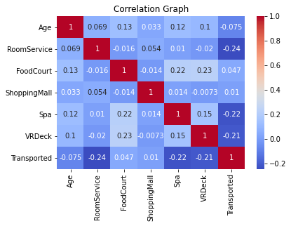
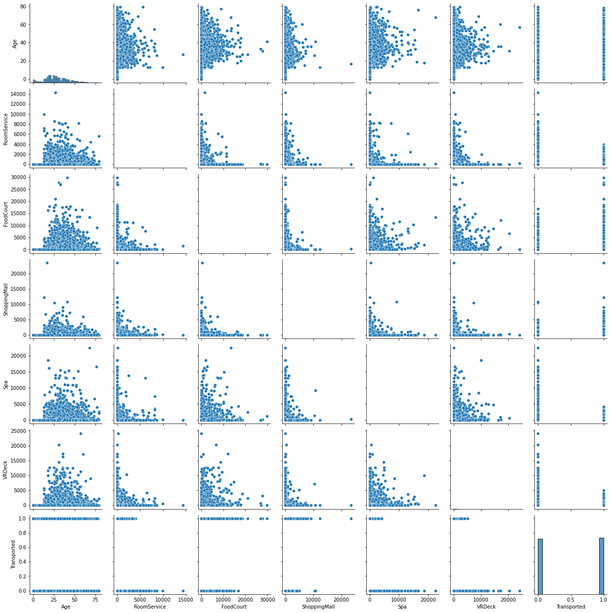
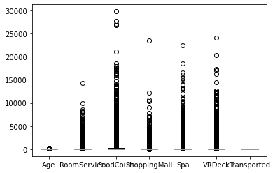
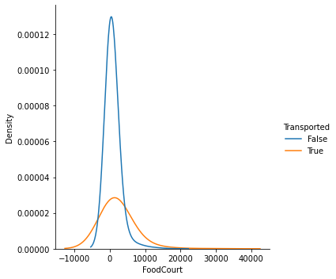
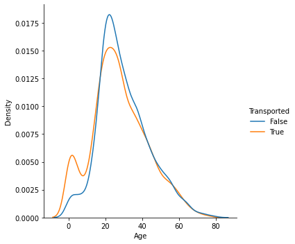
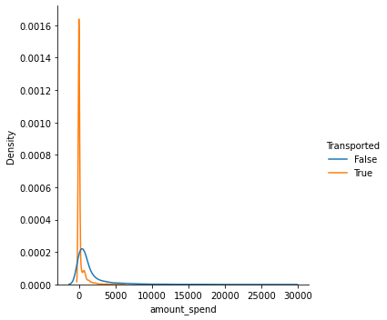
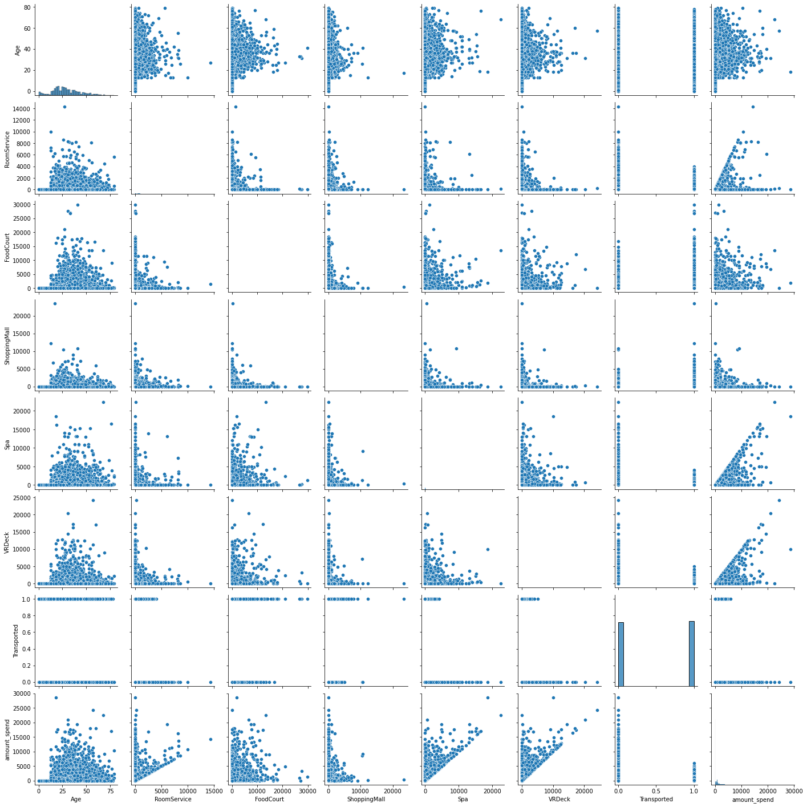

```python
import numpy as np
import pandas as pd
import os
os.chdir('/Users/utkarshvikas/Downloads/')
```


```python
train=pd.read_csv('train (3).csv')
test=pd.read_csv('test (4).csv')
```


```python
train=pd.read_csv('train (3).csv')
train.head()
```


<div>
<style scoped>
    .dataframe tbody tr th:only-of-type {
        vertical-align: middle;
    }

    .dataframe tbody tr th {
        vertical-align: top;
    }

    .dataframe thead th {
        text-align: right;
    }
</style>
<table border="1" class="dataframe">
  <thead>
    <tr style="text-align: right;">
      <th></th>
      <th>PassengerId</th>
      <th>HomePlanet</th>
      <th>CryoSleep</th>
      <th>Cabin</th>
      <th>Destination</th>
      <th>Age</th>
      <th>VIP</th>
      <th>RoomService</th>
      <th>FoodCourt</th>
      <th>ShoppingMall</th>
      <th>Spa</th>
      <th>VRDeck</th>
      <th>Name</th>
      <th>Transported</th>
    </tr>
  </thead>
  <tbody>
    <tr>
      <th>0</th>
      <td>0001_01</td>
      <td>Europa</td>
      <td>False</td>
      <td>B/0/P</td>
      <td>TRAPPIST-1e</td>
      <td>39.0</td>
      <td>False</td>
      <td>0.0</td>
      <td>0.0</td>
      <td>0.0</td>
      <td>0.0</td>
      <td>0.0</td>
      <td>Maham Ofracculy</td>
      <td>False</td>
    </tr>
    <tr>
      <th>1</th>
      <td>0002_01</td>
      <td>Earth</td>
      <td>False</td>
      <td>F/0/S</td>
      <td>TRAPPIST-1e</td>
      <td>24.0</td>
      <td>False</td>
      <td>109.0</td>
      <td>9.0</td>
      <td>25.0</td>
      <td>549.0</td>
      <td>44.0</td>
      <td>Juanna Vines</td>
      <td>True</td>
    </tr>
    <tr>
      <th>2</th>
      <td>0003_01</td>
      <td>Europa</td>
      <td>False</td>
      <td>A/0/S</td>
      <td>TRAPPIST-1e</td>
      <td>58.0</td>
      <td>True</td>
      <td>43.0</td>
      <td>3576.0</td>
      <td>0.0</td>
      <td>6715.0</td>
      <td>49.0</td>
      <td>Altark Susent</td>
      <td>False</td>
    </tr>
    <tr>
      <th>3</th>
      <td>0003_02</td>
      <td>Europa</td>
      <td>False</td>
      <td>A/0/S</td>
      <td>TRAPPIST-1e</td>
      <td>33.0</td>
      <td>False</td>
      <td>0.0</td>
      <td>1283.0</td>
      <td>371.0</td>
      <td>3329.0</td>
      <td>193.0</td>
      <td>Solam Susent</td>
      <td>False</td>
    </tr>
    <tr>
      <th>4</th>
      <td>0004_01</td>
      <td>Earth</td>
      <td>False</td>
      <td>F/1/S</td>
      <td>TRAPPIST-1e</td>
      <td>16.0</td>
      <td>False</td>
      <td>303.0</td>
      <td>70.0</td>
      <td>151.0</td>
      <td>565.0</td>
      <td>2.0</td>
      <td>Willy Santantines</td>
      <td>True</td>
    </tr>
  </tbody>
</table>
</div>


```python
train.shape
```


    (8693, 14)


```python
train.dtypes
```


    PassengerId      object
    HomePlanet       object
    CryoSleep        object
    Cabin            object
    Destination      object
    Age             float64
    VIP              object
    RoomService     float64
    FoodCourt       float64
    ShoppingMall    float64
    Spa             float64
    VRDeck          float64
    Name             object
    Transported        bool
    dtype: object


```python
import seaborn as sns
import matplotlib.pyplot as plt
corr_matrix = train.corr()
sns.heatmap(corr_matrix, cmap='coolwarm', annot=True)
plt.title('Correlation Graph')
plt.show()
```

    <ipython-input-74-08f0e651de86>:3: FutureWarning: The default value of numeric_only in DataFrame.corr is deprecated. In a future version, it will default to False. Select only valid columns or specify the value of numeric_only to silence this warning.
      corr_matrix = train.corr()


    

    


```python
train.pivot_table(train,index='Transported',aggfunc='mean')
```

    <ipython-input-75-b5acce01e89b>:1: FutureWarning: pivot_table dropped a column because it failed to aggregate. This behavior is deprecated and will raise in a future version of pandas. Select only the columns that can be aggregated.
      train.pivot_table(train,index='Transported',aggfunc='mean')


<div>
<style scoped>
    .dataframe tbody tr th:only-of-type {
        vertical-align: middle;
    }

    .dataframe tbody tr th {
        vertical-align: top;
    }

    .dataframe thead th {
        text-align: right;
    }
</style>
<table border="1" class="dataframe">
  <thead>
    <tr style="text-align: right;">
      <th></th>
      <th>Age</th>
      <th>FoodCourt</th>
      <th>RoomService</th>
      <th>ShoppingMall</th>
      <th>Spa</th>
      <th>VRDeck</th>
    </tr>
    <tr>
      <th>Transported</th>
      <th></th>
      <th></th>
      <th></th>
      <th></th>
      <th></th>
      <th></th>
    </tr>
  </thead>
  <tbody>
    <tr>
      <th>False</th>
      <td>29.922858</td>
      <td>382.615930</td>
      <td>389.266066</td>
      <td>167.566217</td>
      <td>564.382666</td>
      <td>543.629822</td>
    </tr>
    <tr>
      <th>True</th>
      <td>27.748834</td>
      <td>532.691984</td>
      <td>63.098021</td>
      <td>179.829972</td>
      <td>61.675531</td>
      <td>69.148131</td>
    </tr>
  </tbody>
</table>
</div>


```python
train.pivot_table(train,index='Transported',aggfunc='mean')
```

    <ipython-input-76-b5acce01e89b>:1: FutureWarning: pivot_table dropped a column because it failed to aggregate. This behavior is deprecated and will raise in a future version of pandas. Select only the columns that can be aggregated.
      train.pivot_table(train,index='Transported',aggfunc='mean')


<div>
<style scoped>
    .dataframe tbody tr th:only-of-type {
        vertical-align: middle;
    }

    .dataframe tbody tr th {
        vertical-align: top;
    }

    .dataframe thead th {
        text-align: right;
    }
</style>
<table border="1" class="dataframe">
  <thead>
    <tr style="text-align: right;">
      <th></th>
      <th>Age</th>
      <th>FoodCourt</th>
      <th>RoomService</th>
      <th>ShoppingMall</th>
      <th>Spa</th>
      <th>VRDeck</th>
    </tr>
    <tr>
      <th>Transported</th>
      <th></th>
      <th></th>
      <th></th>
      <th></th>
      <th></th>
      <th></th>
    </tr>
  </thead>
  <tbody>
    <tr>
      <th>False</th>
      <td>29.922858</td>
      <td>382.615930</td>
      <td>389.266066</td>
      <td>167.566217</td>
      <td>564.382666</td>
      <td>543.629822</td>
    </tr>
    <tr>
      <th>True</th>
      <td>27.748834</td>
      <td>532.691984</td>
      <td>63.098021</td>
      <td>179.829972</td>
      <td>61.675531</td>
      <td>69.148131</td>
    </tr>
  </tbody>
</table>
</div>


```python
train_quant=train.select_dtypes(include=['int', 'float','bool'])

```


```python
train.dtypes
```


    PassengerId      object
    HomePlanet       object
    CryoSleep        object
    Cabin            object
    Destination      object
    Age             float64
    VIP              object
    RoomService     float64
    FoodCourt       float64
    ShoppingMall    float64
    Spa             float64
    VRDeck          float64
    Name             object
    Transported        bool
    dtype: object


```python
train.isnull().sum()
```


    PassengerId       0
    HomePlanet      201
    CryoSleep       217
    Cabin           199
    Destination     182
    Age             179
    VIP             203
    RoomService     181
    FoodCourt       183
    ShoppingMall    208
    Spa             183
    VRDeck          188
    Name            200
    Transported       0
    dtype: int64


```python
sns.pairplot(train_quant,dropna=True)

```

    <__array_function__ internals>:200: RuntimeWarning: Converting input from bool to <class 'numpy.uint8'> for compatibility.


    <seaborn.axisgrid.PairGrid at 0x12ea6b430>


    

    


```python
numeric_cols = train.select_dtypes(include=['int', 'float'])
fig, ax = plt.subplots()
ax.boxplot(train_quant.values)
ax.set_xticklabels(train_quant.columns)
plt.show()
```


    

    


```python
non_zero_data = train.loc[train['FoodCourt'] != 0]
non_zero_data

```


<div>
<style scoped>
    .dataframe tbody tr th:only-of-type {
        vertical-align: middle;
    }

    .dataframe tbody tr th {
        vertical-align: top;
    }

    .dataframe thead th {
        text-align: right;
    }
</style>
<table border="1" class="dataframe">
  <thead>
    <tr style="text-align: right;">
      <th></th>
      <th>PassengerId</th>
      <th>HomePlanet</th>
      <th>CryoSleep</th>
      <th>Cabin</th>
      <th>Destination</th>
      <th>Age</th>
      <th>VIP</th>
      <th>RoomService</th>
      <th>FoodCourt</th>
      <th>ShoppingMall</th>
      <th>Spa</th>
      <th>VRDeck</th>
      <th>Name</th>
      <th>Transported</th>
    </tr>
  </thead>
  <tbody>
    <tr>
      <th>1</th>
      <td>0002_01</td>
      <td>Earth</td>
      <td>False</td>
      <td>F/0/S</td>
      <td>TRAPPIST-1e</td>
      <td>24.0</td>
      <td>False</td>
      <td>109.0</td>
      <td>9.0</td>
      <td>25.0</td>
      <td>549.0</td>
      <td>44.0</td>
      <td>Juanna Vines</td>
      <td>True</td>
    </tr>
    <tr>
      <th>2</th>
      <td>0003_01</td>
      <td>Europa</td>
      <td>False</td>
      <td>A/0/S</td>
      <td>TRAPPIST-1e</td>
      <td>58.0</td>
      <td>True</td>
      <td>43.0</td>
      <td>3576.0</td>
      <td>0.0</td>
      <td>6715.0</td>
      <td>49.0</td>
      <td>Altark Susent</td>
      <td>False</td>
    </tr>
    <tr>
      <th>3</th>
      <td>0003_02</td>
      <td>Europa</td>
      <td>False</td>
      <td>A/0/S</td>
      <td>TRAPPIST-1e</td>
      <td>33.0</td>
      <td>False</td>
      <td>0.0</td>
      <td>1283.0</td>
      <td>371.0</td>
      <td>3329.0</td>
      <td>193.0</td>
      <td>Solam Susent</td>
      <td>False</td>
    </tr>
    <tr>
      <th>4</th>
      <td>0004_01</td>
      <td>Earth</td>
      <td>False</td>
      <td>F/1/S</td>
      <td>TRAPPIST-1e</td>
      <td>16.0</td>
      <td>False</td>
      <td>303.0</td>
      <td>70.0</td>
      <td>151.0</td>
      <td>565.0</td>
      <td>2.0</td>
      <td>Willy Santantines</td>
      <td>True</td>
    </tr>
    <tr>
      <th>5</th>
      <td>0005_01</td>
      <td>Earth</td>
      <td>False</td>
      <td>F/0/P</td>
      <td>PSO J318.5-22</td>
      <td>44.0</td>
      <td>False</td>
      <td>0.0</td>
      <td>483.0</td>
      <td>0.0</td>
      <td>291.0</td>
      <td>0.0</td>
      <td>Sandie Hinetthews</td>
      <td>True</td>
    </tr>
    <tr>
      <th>...</th>
      <td>...</td>
      <td>...</td>
      <td>...</td>
      <td>...</td>
      <td>...</td>
      <td>...</td>
      <td>...</td>
      <td>...</td>
      <td>...</td>
      <td>...</td>
      <td>...</td>
      <td>...</td>
      <td>...</td>
      <td>...</td>
    </tr>
    <tr>
      <th>8686</th>
      <td>9275_02</td>
      <td>Europa</td>
      <td>False</td>
      <td>A/97/P</td>
      <td>TRAPPIST-1e</td>
      <td>32.0</td>
      <td>False</td>
      <td>1.0</td>
      <td>1146.0</td>
      <td>0.0</td>
      <td>50.0</td>
      <td>34.0</td>
      <td>Diram Conable</td>
      <td>False</td>
    </tr>
    <tr>
      <th>8687</th>
      <td>9275_03</td>
      <td>Europa</td>
      <td>NaN</td>
      <td>A/97/P</td>
      <td>TRAPPIST-1e</td>
      <td>30.0</td>
      <td>False</td>
      <td>0.0</td>
      <td>3208.0</td>
      <td>0.0</td>
      <td>2.0</td>
      <td>330.0</td>
      <td>Atlasym Conable</td>
      <td>True</td>
    </tr>
    <tr>
      <th>8688</th>
      <td>9276_01</td>
      <td>Europa</td>
      <td>False</td>
      <td>A/98/P</td>
      <td>55 Cancri e</td>
      <td>41.0</td>
      <td>True</td>
      <td>0.0</td>
      <td>6819.0</td>
      <td>0.0</td>
      <td>1643.0</td>
      <td>74.0</td>
      <td>Gravior Noxnuther</td>
      <td>False</td>
    </tr>
    <tr>
      <th>8691</th>
      <td>9280_01</td>
      <td>Europa</td>
      <td>False</td>
      <td>E/608/S</td>
      <td>55 Cancri e</td>
      <td>32.0</td>
      <td>False</td>
      <td>0.0</td>
      <td>1049.0</td>
      <td>0.0</td>
      <td>353.0</td>
      <td>3235.0</td>
      <td>Celeon Hontichre</td>
      <td>False</td>
    </tr>
    <tr>
      <th>8692</th>
      <td>9280_02</td>
      <td>Europa</td>
      <td>False</td>
      <td>E/608/S</td>
      <td>TRAPPIST-1e</td>
      <td>44.0</td>
      <td>False</td>
      <td>126.0</td>
      <td>4688.0</td>
      <td>0.0</td>
      <td>0.0</td>
      <td>12.0</td>
      <td>Propsh Hontichre</td>
      <td>True</td>
    </tr>
  </tbody>
</table>
<p>3237 rows × 14 columns</p>
</div>


```python
import seaborn as sns
#non_zero_data = train.loc[data['Foodcourt'] != 0]


# create the plot
sns.displot(data=non_zero_data, x='FoodCourt', hue='Transported', kind='kde',bw_adjust=5)

# display the plot
plt.show()
```


    

    


```python
sns.scatterplot(data=foodcourt, x='FoodCourt', y='FoodCourt', hue='Transported')
#0-1000, 1000-17500, 17500+

```


    ---------------------------------------------------------------------------

    NameError                                 Traceback (most recent call last)

    <ipython-input-16-00ae600135ad> in <module>
    ----> 1 sns.scatterplot(data=foodcourt, x='FoodCourt', y='FoodCourt', hue='Transported')
          2 #0-1000, 1000-17500, 17500+


    NameError: name 'foodcourt' is not defined


```python
train.describe()
```


<div>
<style scoped>
    .dataframe tbody tr th:only-of-type {
        vertical-align: middle;
    }

    .dataframe tbody tr th {
        vertical-align: top;
    }

    .dataframe thead th {
        text-align: right;
    }
</style>
<table border="1" class="dataframe">
  <thead>
    <tr style="text-align: right;">
      <th></th>
      <th>Age</th>
      <th>RoomService</th>
      <th>FoodCourt</th>
      <th>ShoppingMall</th>
      <th>Spa</th>
      <th>VRDeck</th>
    </tr>
  </thead>
  <tbody>
    <tr>
      <th>count</th>
      <td>8514.000000</td>
      <td>8512.000000</td>
      <td>8510.000000</td>
      <td>8485.000000</td>
      <td>8510.000000</td>
      <td>8505.000000</td>
    </tr>
    <tr>
      <th>mean</th>
      <td>28.827930</td>
      <td>224.687617</td>
      <td>458.077203</td>
      <td>173.729169</td>
      <td>311.138778</td>
      <td>304.854791</td>
    </tr>
    <tr>
      <th>std</th>
      <td>14.489021</td>
      <td>666.717663</td>
      <td>1611.489240</td>
      <td>604.696458</td>
      <td>1136.705535</td>
      <td>1145.717189</td>
    </tr>
    <tr>
      <th>min</th>
      <td>0.000000</td>
      <td>0.000000</td>
      <td>0.000000</td>
      <td>0.000000</td>
      <td>0.000000</td>
      <td>0.000000</td>
    </tr>
    <tr>
      <th>25%</th>
      <td>19.000000</td>
      <td>0.000000</td>
      <td>0.000000</td>
      <td>0.000000</td>
      <td>0.000000</td>
      <td>0.000000</td>
    </tr>
    <tr>
      <th>50%</th>
      <td>27.000000</td>
      <td>0.000000</td>
      <td>0.000000</td>
      <td>0.000000</td>
      <td>0.000000</td>
      <td>0.000000</td>
    </tr>
    <tr>
      <th>75%</th>
      <td>38.000000</td>
      <td>47.000000</td>
      <td>76.000000</td>
      <td>27.000000</td>
      <td>59.000000</td>
      <td>46.000000</td>
    </tr>
    <tr>
      <th>max</th>
      <td>79.000000</td>
      <td>14327.000000</td>
      <td>29813.000000</td>
      <td>23492.000000</td>
      <td>22408.000000</td>
      <td>24133.000000</td>
    </tr>
  </tbody>
</table>
</div>


```python
train.pivot_table(index='Transported',columns=(train['VRDeck'] != 0),aggfunc='size')
```


<div>
<style scoped>
    .dataframe tbody tr th:only-of-type {
        vertical-align: middle;
    }

    .dataframe tbody tr th {
        vertical-align: top;
    }

    .dataframe thead th {
        text-align: right;
    }
</style>
<table border="1" class="dataframe">
  <thead>
    <tr style="text-align: right;">
      <th>VRDeck</th>
      <th>False</th>
      <th>True</th>
    </tr>
    <tr>
      <th>Transported</th>
      <th></th>
      <th></th>
    </tr>
  </thead>
  <tbody>
    <tr>
      <th>False</th>
      <td>2044</td>
      <td>2271</td>
    </tr>
    <tr>
      <th>True</th>
      <td>3451</td>
      <td>927</td>
    </tr>
  </tbody>
</table>
</div>


```python
train['amount_spend'] = train['RoomService'].fillna(0) + train['Spa'].fillna(0) + train['VRDeck'].fillna(0)
train.isnull().sum()
```


    PassengerId       0
    HomePlanet      201
    CryoSleep       217
    Cabin           199
    Destination     182
    Age             179
    VIP             203
    RoomService     181
    FoodCourt       183
    ShoppingMall    208
    Spa             183
    VRDeck          188
    Name            200
    Transported       0
    amount_spend      0
    dtype: int64


```python
train.pivot_table(index='Transported',columns=(train['RoomService'] != 0),aggfunc='size')
```


<div>
<style scoped>
    .dataframe tbody tr th:only-of-type {
        vertical-align: middle;
    }

    .dataframe tbody tr th {
        vertical-align: top;
    }

    .dataframe thead th {
        text-align: right;
    }
</style>
<table border="1" class="dataframe">
  <thead>
    <tr style="text-align: right;">
      <th>RoomService</th>
      <th>False</th>
      <th>True</th>
    </tr>
    <tr>
      <th>Transported</th>
      <th></th>
      <th></th>
    </tr>
  </thead>
  <tbody>
    <tr>
      <th>False</th>
      <td>2045</td>
      <td>2270</td>
    </tr>
    <tr>
      <th>True</th>
      <td>3532</td>
      <td>846</td>
    </tr>
  </tbody>
</table>
</div>


```python
train['Age'].min()
```


    0.0


```python
# create the plot
sns.displot(data=train, x='Age', hue='Transported', kind='kde')

# get the KDE plot artists
artists = plt.gca().artists

# check the number of artists
if len(artists) < 2:
    raise ValueError('The plot does not have enough artists to extract the KDE plot data')

# extract the data for the KDE plots
x1, y1 = artists[0].get_lines()[0].get_data()
x2, y2 = artists[1].get_lines()[0].get_data()

# find the intersection points
intersection_points = np.intersect1d(x1, x2)

# print the intersection points
print('Intersection points:', intersection_points)

# display the plot
plt.show()
## create a list of bin edges
#bin_edges = [,10,18,24,40, df['Age'].max()]=
```


    ---------------------------------------------------------------------------

    ValueError                                Traceback (most recent call last)

    <ipython-input-22-25502bfa66fa> in <module>
          7 # check the number of artists
          8 if len(artists) < 2:
    ----> 9     raise ValueError('The plot does not have enough artists to extract the KDE plot data')
         10 
         11 # extract the data for the KDE plots


    ValueError: The plot does not have enough artists to extract the KDE plot data


    

    


```python
train_work=train
```


```python
bin_edges = [train_work['Age'].min(),10,18,24,40, train_work['Age'].max()]
# create a list of bin labels
bin_labels = ['<10', '10-18', '18-24', '24-40', '40+']
train_work['AgeCategory'] = pd.cut(train_work['Age'], bins=bin_edges, labels=bin_labels)
#train_work['AgeCategory'].fillna(value='<10', inplace=True)
subset = train_work.loc[train_work['Age'].notnull(), 'AgeCategory']
subset.fillna(value='<10', inplace=True)
train_work.loc[train_work['Age'].notnull(), 'AgeCategory'] = subset
train_work.isnull().sum()

```


    PassengerId       0
    HomePlanet      201
    CryoSleep       217
    Cabin           199
    Destination     182
    Age             179
    VIP             203
    RoomService     181
    FoodCourt       183
    ShoppingMall    208
    Spa             183
    VRDeck          188
    Name            200
    Transported       0
    amount_spend      0
    AgeCategory     179
    dtype: int64


```python
train_work.drop('Age',axis=1)

```


<div>
<style scoped>
    .dataframe tbody tr th:only-of-type {
        vertical-align: middle;
    }

    .dataframe tbody tr th {
        vertical-align: top;
    }

    .dataframe thead th {
        text-align: right;
    }
</style>
<table border="1" class="dataframe">
  <thead>
    <tr style="text-align: right;">
      <th></th>
      <th>PassengerId</th>
      <th>HomePlanet</th>
      <th>CryoSleep</th>
      <th>Cabin</th>
      <th>Destination</th>
      <th>VIP</th>
      <th>RoomService</th>
      <th>FoodCourt</th>
      <th>ShoppingMall</th>
      <th>Spa</th>
      <th>VRDeck</th>
      <th>Name</th>
      <th>Transported</th>
      <th>amount_spend</th>
      <th>AgeCategory</th>
    </tr>
  </thead>
  <tbody>
    <tr>
      <th>0</th>
      <td>0001_01</td>
      <td>Europa</td>
      <td>False</td>
      <td>B/0/P</td>
      <td>TRAPPIST-1e</td>
      <td>False</td>
      <td>0.0</td>
      <td>0.0</td>
      <td>0.0</td>
      <td>0.0</td>
      <td>0.0</td>
      <td>Maham Ofracculy</td>
      <td>False</td>
      <td>0.0</td>
      <td>24-40</td>
    </tr>
    <tr>
      <th>1</th>
      <td>0002_01</td>
      <td>Earth</td>
      <td>False</td>
      <td>F/0/S</td>
      <td>TRAPPIST-1e</td>
      <td>False</td>
      <td>109.0</td>
      <td>9.0</td>
      <td>25.0</td>
      <td>549.0</td>
      <td>44.0</td>
      <td>Juanna Vines</td>
      <td>True</td>
      <td>702.0</td>
      <td>18-24</td>
    </tr>
    <tr>
      <th>2</th>
      <td>0003_01</td>
      <td>Europa</td>
      <td>False</td>
      <td>A/0/S</td>
      <td>TRAPPIST-1e</td>
      <td>True</td>
      <td>43.0</td>
      <td>3576.0</td>
      <td>0.0</td>
      <td>6715.0</td>
      <td>49.0</td>
      <td>Altark Susent</td>
      <td>False</td>
      <td>6807.0</td>
      <td>40+</td>
    </tr>
    <tr>
      <th>3</th>
      <td>0003_02</td>
      <td>Europa</td>
      <td>False</td>
      <td>A/0/S</td>
      <td>TRAPPIST-1e</td>
      <td>False</td>
      <td>0.0</td>
      <td>1283.0</td>
      <td>371.0</td>
      <td>3329.0</td>
      <td>193.0</td>
      <td>Solam Susent</td>
      <td>False</td>
      <td>3522.0</td>
      <td>24-40</td>
    </tr>
    <tr>
      <th>4</th>
      <td>0004_01</td>
      <td>Earth</td>
      <td>False</td>
      <td>F/1/S</td>
      <td>TRAPPIST-1e</td>
      <td>False</td>
      <td>303.0</td>
      <td>70.0</td>
      <td>151.0</td>
      <td>565.0</td>
      <td>2.0</td>
      <td>Willy Santantines</td>
      <td>True</td>
      <td>870.0</td>
      <td>10-18</td>
    </tr>
    <tr>
      <th>...</th>
      <td>...</td>
      <td>...</td>
      <td>...</td>
      <td>...</td>
      <td>...</td>
      <td>...</td>
      <td>...</td>
      <td>...</td>
      <td>...</td>
      <td>...</td>
      <td>...</td>
      <td>...</td>
      <td>...</td>
      <td>...</td>
      <td>...</td>
    </tr>
    <tr>
      <th>8688</th>
      <td>9276_01</td>
      <td>Europa</td>
      <td>False</td>
      <td>A/98/P</td>
      <td>55 Cancri e</td>
      <td>True</td>
      <td>0.0</td>
      <td>6819.0</td>
      <td>0.0</td>
      <td>1643.0</td>
      <td>74.0</td>
      <td>Gravior Noxnuther</td>
      <td>False</td>
      <td>1717.0</td>
      <td>40+</td>
    </tr>
    <tr>
      <th>8689</th>
      <td>9278_01</td>
      <td>Earth</td>
      <td>True</td>
      <td>G/1499/S</td>
      <td>PSO J318.5-22</td>
      <td>False</td>
      <td>0.0</td>
      <td>0.0</td>
      <td>0.0</td>
      <td>0.0</td>
      <td>0.0</td>
      <td>Kurta Mondalley</td>
      <td>False</td>
      <td>0.0</td>
      <td>10-18</td>
    </tr>
    <tr>
      <th>8690</th>
      <td>9279_01</td>
      <td>Earth</td>
      <td>False</td>
      <td>G/1500/S</td>
      <td>TRAPPIST-1e</td>
      <td>False</td>
      <td>0.0</td>
      <td>0.0</td>
      <td>1872.0</td>
      <td>1.0</td>
      <td>0.0</td>
      <td>Fayey Connon</td>
      <td>True</td>
      <td>1.0</td>
      <td>24-40</td>
    </tr>
    <tr>
      <th>8691</th>
      <td>9280_01</td>
      <td>Europa</td>
      <td>False</td>
      <td>E/608/S</td>
      <td>55 Cancri e</td>
      <td>False</td>
      <td>0.0</td>
      <td>1049.0</td>
      <td>0.0</td>
      <td>353.0</td>
      <td>3235.0</td>
      <td>Celeon Hontichre</td>
      <td>False</td>
      <td>3588.0</td>
      <td>24-40</td>
    </tr>
    <tr>
      <th>8692</th>
      <td>9280_02</td>
      <td>Europa</td>
      <td>False</td>
      <td>E/608/S</td>
      <td>TRAPPIST-1e</td>
      <td>False</td>
      <td>126.0</td>
      <td>4688.0</td>
      <td>0.0</td>
      <td>0.0</td>
      <td>12.0</td>
      <td>Propsh Hontichre</td>
      <td>True</td>
      <td>138.0</td>
      <td>40+</td>
    </tr>
  </tbody>
</table>
<p>8693 rows × 15 columns</p>
</div>


```python
train_work.dtypes
```


    PassengerId       object
    HomePlanet        object
    CryoSleep         object
    Cabin             object
    Destination       object
    Age              float64
    VIP               object
    RoomService      float64
    FoodCourt        float64
    ShoppingMall     float64
    Spa              float64
    VRDeck           float64
    Name              object
    Transported         bool
    amount_spend     float64
    AgeCategory     category
    dtype: object


```python
# create the plot
sns.displot(data=train, x='amount_spend', hue='Transported', kind='kde')

# get the KDE plot artists
artists = plt.gca().artists

# check the number of artists
if len(artists) < 2:
    raise ValueError('The plot does not have enough artists to extract the KDE plot data')

# extract the data for the KDE plots
x1, y1 = artists[0].get_lines()[0].get_data()
x2, y2 = artists[1].get_lines()[0].get_data()

# find the intersection points
intersection_points = np.intersect1d(x1, x2)

# print the intersection points
print('Intersection points:', intersection_points)

# display the plot
plt.show()
## create a list of bin edges
#bin_edges = [,10,18,24,40, df['Age'].max()]=
```


    ---------------------------------------------------------------------------

    ValueError                                Traceback (most recent call last)

    <ipython-input-92-dc6525fb10f4> in <module>
          7 # check the number of artists
          8 if len(artists) < 2:
    ----> 9     raise ValueError('The plot does not have enough artists to extract the KDE plot data')
         10 
         11 # extract the data for the KDE plots


    ValueError: The plot does not have enough artists to extract the KDE plot data


    

    


```python
train_quant_2=train_work.select_dtypes(include=['int', 'float','bool'])


```


```python
sns.pairplot(train_quant_2,dropna=True)


```

    <__array_function__ internals>:200: RuntimeWarning: Converting input from bool to <class 'numpy.uint8'> for compatibility.


    <seaborn.axisgrid.PairGrid at 0x12c0d5e20>


    

    


```python
test.isnull().sum()
```


    PassengerId       0
    HomePlanet       87
    CryoSleep        93
    Cabin           100
    Destination      92
    Age              91
    VIP              93
    RoomService      82
    FoodCourt       106
    ShoppingMall     98
    Spa             101
    VRDeck           80
    Name             94
    dtype: int64


```python
test['amount_spend'] = test['RoomService'].fillna(0) + test['Spa'].fillna(0) + test['VRDeck'].fillna(0)


```


```python
train_work.isnull().sum()
```


    PassengerId       0
    HomePlanet      201
    CryoSleep       217
    Cabin           199
    Destination     182
    Age             179
    VIP             203
    RoomService     181
    FoodCourt       183
    ShoppingMall    208
    Spa             183
    VRDeck          188
    Name            200
    Transported       0
    amount_spend      0
    AgeCategory     179
    dtype: int64


```python
test.isnull().sum()
```


    PassengerId       0
    HomePlanet       87
    CryoSleep        93
    Cabin           100
    Destination      92
    Age              91
    VIP              93
    RoomService      82
    FoodCourt       106
    ShoppingMall     98
    Spa             101
    VRDeck           80
    Name             94
    amount_spend      0
    dtype: int64


```python
bin_edges = [test['Age'].min(),10,18,24,40, test['Age'].max()]
# create a list of bin labels
bin_labels = ['<10', '10-18', '18-24', '24-40', '40+']
test['AgeCategory'] = pd.cut(test['Age'], bins=bin_edges, labels=bin_labels)
#train_work['AgeCategory'].fillna(value='<10', inplace=True)
subset = test.loc[test['Age'].notnull(), 'AgeCategory']
subset.fillna(value='<10', inplace=True)
test.loc[test['Age'].notnull(), 'AgeCategory'] = subset
test.isnull().sum()


```


    PassengerId       0
    HomePlanet       87
    CryoSleep        93
    Cabin           100
    Destination      92
    Age              91
    VIP              93
    RoomService      82
    FoodCourt       106
    ShoppingMall     98
    Spa             101
    VRDeck           80
    Name             94
    amount_spend      0
    AgeCategory      91
    dtype: int64


```python
test.isnull().any()
test.shape
train_work.shape
```


    (8693, 16)


```python
train_work.isnull().sum()
```


    PassengerId       0
    HomePlanet      201
    CryoSleep       217
    Cabin           199
    Destination     182
    Age             179
    VIP             203
    RoomService     181
    FoodCourt       183
    ShoppingMall    208
    Spa             183
    VRDeck          188
    Name            200
    Transported       0
    amount_spend      0
    AgeCategory     179
    dtype: int64


```python
#train_work()
train_work = train_work.drop(['Age','RoomService','FoodCourt','ShoppingMall','Spa','VRDeck','Name'], axis=1)
#test = test.drop(['Age','RoomService','FoodCourt','ShoppingMall','Spa','VRDeck','Name'], axis=1)
```


```python
train_work.isnull().sum()
```


    PassengerId       0
    HomePlanet      201
    CryoSleep       217
    Cabin           199
    Destination     182
    VIP             203
    Transported       0
    amount_spend      0
    AgeCategory     179
    dtype: int64


```python
test = test.drop(['Age','RoomService','FoodCourt','ShoppingMall','Spa','VRDeck','Name'], axis=1)
```


```python
test.isnull().sum()
```


    PassengerId       0
    HomePlanet       87
    CryoSleep        93
    Cabin           100
    Destination      92
    VIP              93
    amount_spend      0
    AgeCategory      91
    dtype: int64


```python
test.dtypes
```


    PassengerId       object
    HomePlanet        object
    CryoSleep         object
    Cabin             object
    Destination       object
    VIP               object
    amount_spend     float64
    AgeCategory     category
    dtype: object


```python
from sklearn.impute import SimpleImputer

# Create an imputer object with the constant strategy and fill values
imputer = SimpleImputer(strategy='constant', fill_value={'HomePlanet': 'unknown_home', CryoSleep: 'unknown_info',Cabin:'unknown_Cabin',Destination:'unknown_Dest',VIP:'unknown_vip',AgeCategory:'unknown_AgeCategory'})

# Fit and transform the test data
train_work_imputed = imputer.fit_transform(train_work)
test_imputed = imputer.fit_transform(test)

```


    ---------------------------------------------------------------------------

    NameError                                 Traceback (most recent call last)

    <ipython-input-106-2b3584271bf0> in <module>
          2 
          3 # Create an imputer object with the constant strategy and fill values
    ----> 4 imputer = SimpleImputer(strategy='constant', fill_value={HomePlanet: 'unknown_home', CryoSleep: 'unknown_info',Cabin:'unknown_Cabin',Destination:'unknown_Dest',VIP:'unknown_vip',AgeCategory:'unknown_AgeCategory'})
          5 
          6 # Fit and transform the test data


    NameError: name 'HomePlanet' is not defined


```python
for df in [train_work, test]:
    df['AgeCategory'] = df['AgeCategory'].cat.add_categories(['unknown_AgeCategory'])
    df.loc[df['AgeCategory'].isna(), 'AgeCategory'] = 'unknown_AgeCategory'
```


```python
from sklearn.impute import SimpleImputer

# Simply fill na
fill_values={'HomePlanet': 'unknown_home', 'CryoSleep': 'unknown_info','Cabin':'unknown_Cabin','Destination':'unknown_Dest','VIP':'unknown_vip'}

# Fit and transform the test data
train_work_imputed = train_work.fillna(value=fill_values)
test_imputed = test.fillna(value=fill_values)


```


```python
train_work_imputed
```


<div>
<style scoped>
    .dataframe tbody tr th:only-of-type {
        vertical-align: middle;
    }

    .dataframe tbody tr th {
        vertical-align: top;
    }

    .dataframe thead th {
        text-align: right;
    }
</style>
<table border="1" class="dataframe">
  <thead>
    <tr style="text-align: right;">
      <th></th>
      <th>PassengerId</th>
      <th>HomePlanet</th>
      <th>CryoSleep</th>
      <th>Cabin</th>
      <th>Destination</th>
      <th>VIP</th>
      <th>Transported</th>
      <th>amount_spend</th>
      <th>AgeCategory</th>
    </tr>
  </thead>
  <tbody>
    <tr>
      <th>0</th>
      <td>0001_01</td>
      <td>Europa</td>
      <td>False</td>
      <td>B/0/P</td>
      <td>TRAPPIST-1e</td>
      <td>False</td>
      <td>False</td>
      <td>0.0</td>
      <td>24-40</td>
    </tr>
    <tr>
      <th>1</th>
      <td>0002_01</td>
      <td>Earth</td>
      <td>False</td>
      <td>F/0/S</td>
      <td>TRAPPIST-1e</td>
      <td>False</td>
      <td>True</td>
      <td>702.0</td>
      <td>18-24</td>
    </tr>
    <tr>
      <th>2</th>
      <td>0003_01</td>
      <td>Europa</td>
      <td>False</td>
      <td>A/0/S</td>
      <td>TRAPPIST-1e</td>
      <td>True</td>
      <td>False</td>
      <td>6807.0</td>
      <td>40+</td>
    </tr>
    <tr>
      <th>3</th>
      <td>0003_02</td>
      <td>Europa</td>
      <td>False</td>
      <td>A/0/S</td>
      <td>TRAPPIST-1e</td>
      <td>False</td>
      <td>False</td>
      <td>3522.0</td>
      <td>24-40</td>
    </tr>
    <tr>
      <th>4</th>
      <td>0004_01</td>
      <td>Earth</td>
      <td>False</td>
      <td>F/1/S</td>
      <td>TRAPPIST-1e</td>
      <td>False</td>
      <td>True</td>
      <td>870.0</td>
      <td>10-18</td>
    </tr>
    <tr>
      <th>...</th>
      <td>...</td>
      <td>...</td>
      <td>...</td>
      <td>...</td>
      <td>...</td>
      <td>...</td>
      <td>...</td>
      <td>...</td>
      <td>...</td>
    </tr>
    <tr>
      <th>8688</th>
      <td>9276_01</td>
      <td>Europa</td>
      <td>False</td>
      <td>A/98/P</td>
      <td>55 Cancri e</td>
      <td>True</td>
      <td>False</td>
      <td>1717.0</td>
      <td>40+</td>
    </tr>
    <tr>
      <th>8689</th>
      <td>9278_01</td>
      <td>Earth</td>
      <td>True</td>
      <td>G/1499/S</td>
      <td>PSO J318.5-22</td>
      <td>False</td>
      <td>False</td>
      <td>0.0</td>
      <td>10-18</td>
    </tr>
    <tr>
      <th>8690</th>
      <td>9279_01</td>
      <td>Earth</td>
      <td>False</td>
      <td>G/1500/S</td>
      <td>TRAPPIST-1e</td>
      <td>False</td>
      <td>True</td>
      <td>1.0</td>
      <td>24-40</td>
    </tr>
    <tr>
      <th>8691</th>
      <td>9280_01</td>
      <td>Europa</td>
      <td>False</td>
      <td>E/608/S</td>
      <td>55 Cancri e</td>
      <td>False</td>
      <td>False</td>
      <td>3588.0</td>
      <td>24-40</td>
    </tr>
    <tr>
      <th>8692</th>
      <td>9280_02</td>
      <td>Europa</td>
      <td>False</td>
      <td>E/608/S</td>
      <td>TRAPPIST-1e</td>
      <td>False</td>
      <td>True</td>
      <td>138.0</td>
      <td>40+</td>
    </tr>
  </tbody>
</table>
<p>8693 rows × 9 columns</p>
</div>


```python
train_work_imputed = pd.DataFrame(train_work_imputed, columns=train_work.columns)

```


```python
train_work_imputed.amount_spend
```


    0          0.0
    1        702.0
    2       6807.0
    3       3522.0
    4        870.0
             ...  
    8688    1717.0
    8689       0.0
    8690       1.0
    8691    3588.0
    8692     138.0
    Name: amount_spend, Length: 8693, dtype: float64


```python
train_work_imputed['amount_spend'] = train_work_imputed['amount_spend'].astype(float)

```


```python
train_work_imputed.dtypes
```


    PassengerId       object
    HomePlanet        object
    CryoSleep         object
    Cabin             object
    Destination       object
    VIP               object
    Transported         bool
    amount_spend     float64
    AgeCategory     category
    dtype: object


```python
test_imputed = pd.DataFrame(test_imputed, columns=test.columns)


```


```python
test_imputed.dtypes
```


    PassengerId       object
    HomePlanet        object
    CryoSleep         object
    Cabin             object
    Destination       object
    VIP               object
    amount_spend     float64
    AgeCategory     category
    dtype: object


```python
test_imputed['amount_spend'] = test_imputed['amount_spend'].astype(float)


```


```python
test_imputed
```


<div>
<style scoped>
    .dataframe tbody tr th:only-of-type {
        vertical-align: middle;
    }

    .dataframe tbody tr th {
        vertical-align: top;
    }

    .dataframe thead th {
        text-align: right;
    }
</style>
<table border="1" class="dataframe">
  <thead>
    <tr style="text-align: right;">
      <th></th>
      <th>PassengerId</th>
      <th>HomePlanet</th>
      <th>CryoSleep</th>
      <th>Cabin</th>
      <th>Destination</th>
      <th>VIP</th>
      <th>amount_spend</th>
      <th>AgeCategory</th>
    </tr>
  </thead>
  <tbody>
    <tr>
      <th>0</th>
      <td>0013_01</td>
      <td>Earth</td>
      <td>True</td>
      <td>G/3/S</td>
      <td>TRAPPIST-1e</td>
      <td>False</td>
      <td>0.0</td>
      <td>24-40</td>
    </tr>
    <tr>
      <th>1</th>
      <td>0018_01</td>
      <td>Earth</td>
      <td>False</td>
      <td>F/4/S</td>
      <td>TRAPPIST-1e</td>
      <td>False</td>
      <td>2823.0</td>
      <td>18-24</td>
    </tr>
    <tr>
      <th>2</th>
      <td>0019_01</td>
      <td>Europa</td>
      <td>True</td>
      <td>C/0/S</td>
      <td>55 Cancri e</td>
      <td>False</td>
      <td>0.0</td>
      <td>24-40</td>
    </tr>
    <tr>
      <th>3</th>
      <td>0021_01</td>
      <td>Europa</td>
      <td>False</td>
      <td>C/1/S</td>
      <td>TRAPPIST-1e</td>
      <td>False</td>
      <td>766.0</td>
      <td>24-40</td>
    </tr>
    <tr>
      <th>4</th>
      <td>0023_01</td>
      <td>Earth</td>
      <td>False</td>
      <td>F/5/S</td>
      <td>TRAPPIST-1e</td>
      <td>False</td>
      <td>10.0</td>
      <td>18-24</td>
    </tr>
    <tr>
      <th>...</th>
      <td>...</td>
      <td>...</td>
      <td>...</td>
      <td>...</td>
      <td>...</td>
      <td>...</td>
      <td>...</td>
      <td>...</td>
    </tr>
    <tr>
      <th>4272</th>
      <td>9266_02</td>
      <td>Earth</td>
      <td>True</td>
      <td>G/1496/S</td>
      <td>TRAPPIST-1e</td>
      <td>False</td>
      <td>0.0</td>
      <td>24-40</td>
    </tr>
    <tr>
      <th>4273</th>
      <td>9269_01</td>
      <td>Earth</td>
      <td>False</td>
      <td>{'HomePlanet': 'unknown_home', 'CryoSleep': 'u...</td>
      <td>TRAPPIST-1e</td>
      <td>False</td>
      <td>154.0</td>
      <td>40+</td>
    </tr>
    <tr>
      <th>4274</th>
      <td>9271_01</td>
      <td>Mars</td>
      <td>True</td>
      <td>D/296/P</td>
      <td>55 Cancri e</td>
      <td>False</td>
      <td>0.0</td>
      <td>{'HomePlanet': 'unknown_home', 'CryoSleep': 'u...</td>
    </tr>
    <tr>
      <th>4275</th>
      <td>9273_01</td>
      <td>Europa</td>
      <td>False</td>
      <td>D/297/P</td>
      <td>{'HomePlanet': 'unknown_home', 'CryoSleep': 'u...</td>
      <td>False</td>
      <td>523.0</td>
      <td>{'HomePlanet': 'unknown_home', 'CryoSleep': 'u...</td>
    </tr>
    <tr>
      <th>4276</th>
      <td>9277_01</td>
      <td>Earth</td>
      <td>True</td>
      <td>G/1498/S</td>
      <td>PSO J318.5-22</td>
      <td>False</td>
      <td>0.0</td>
      <td>40+</td>
    </tr>
  </tbody>
</table>
<p>4277 rows × 8 columns</p>
</div>


```python
train_final=train_work_imputed
test_final=test_imputed
```


```python
train_final.isnull().sum()
```


    PassengerId     0
    HomePlanet      0
    CryoSleep       0
    Cabin           0
    Destination     0
    VIP             0
    Transported     0
    amount_spend    0
    AgeCategory     0
    dtype: int64


```python
train_final.pivot_table(index='HomePlanet',aggfunc='size')
```


    HomePlanet
    Earth           4602
    Europa          2131
    Mars            1759
    unknown_home     201
    dtype: int64


```python
test_final.isnull().sum()
```


    PassengerId     0
    HomePlanet      0
    CryoSleep       0
    Cabin           0
    Destination     0
    VIP             0
    amount_spend    0
    AgeCategory     0
    dtype: int64


```python
train_final = train_final.applymap(lambda x: str(x) if isinstance(x, dict) else x)


```


```python
train_final
```


<div>
<style scoped>
    .dataframe tbody tr th:only-of-type {
        vertical-align: middle;
    }

    .dataframe tbody tr th {
        vertical-align: top;
    }

    .dataframe thead th {
        text-align: right;
    }
</style>
<table border="1" class="dataframe">
  <thead>
    <tr style="text-align: right;">
      <th></th>
      <th>PassengerId</th>
      <th>HomePlanet</th>
      <th>CryoSleep</th>
      <th>Cabin</th>
      <th>Destination</th>
      <th>VIP</th>
      <th>Transported</th>
      <th>amount_spend</th>
      <th>AgeCategory</th>
    </tr>
  </thead>
  <tbody>
    <tr>
      <th>0</th>
      <td>0001_01</td>
      <td>Europa</td>
      <td>False</td>
      <td>B/0/P</td>
      <td>TRAPPIST-1e</td>
      <td>False</td>
      <td>False</td>
      <td>0.0</td>
      <td>24-40</td>
    </tr>
    <tr>
      <th>1</th>
      <td>0002_01</td>
      <td>Earth</td>
      <td>False</td>
      <td>F/0/S</td>
      <td>TRAPPIST-1e</td>
      <td>False</td>
      <td>True</td>
      <td>702.0</td>
      <td>18-24</td>
    </tr>
    <tr>
      <th>2</th>
      <td>0003_01</td>
      <td>Europa</td>
      <td>False</td>
      <td>A/0/S</td>
      <td>TRAPPIST-1e</td>
      <td>True</td>
      <td>False</td>
      <td>6807.0</td>
      <td>40+</td>
    </tr>
    <tr>
      <th>3</th>
      <td>0003_02</td>
      <td>Europa</td>
      <td>False</td>
      <td>A/0/S</td>
      <td>TRAPPIST-1e</td>
      <td>False</td>
      <td>False</td>
      <td>3522.0</td>
      <td>24-40</td>
    </tr>
    <tr>
      <th>4</th>
      <td>0004_01</td>
      <td>Earth</td>
      <td>False</td>
      <td>F/1/S</td>
      <td>TRAPPIST-1e</td>
      <td>False</td>
      <td>True</td>
      <td>870.0</td>
      <td>10-18</td>
    </tr>
    <tr>
      <th>...</th>
      <td>...</td>
      <td>...</td>
      <td>...</td>
      <td>...</td>
      <td>...</td>
      <td>...</td>
      <td>...</td>
      <td>...</td>
      <td>...</td>
    </tr>
    <tr>
      <th>8688</th>
      <td>9276_01</td>
      <td>Europa</td>
      <td>False</td>
      <td>A/98/P</td>
      <td>55 Cancri e</td>
      <td>True</td>
      <td>False</td>
      <td>1717.0</td>
      <td>40+</td>
    </tr>
    <tr>
      <th>8689</th>
      <td>9278_01</td>
      <td>Earth</td>
      <td>True</td>
      <td>G/1499/S</td>
      <td>PSO J318.5-22</td>
      <td>False</td>
      <td>False</td>
      <td>0.0</td>
      <td>10-18</td>
    </tr>
    <tr>
      <th>8690</th>
      <td>9279_01</td>
      <td>Earth</td>
      <td>False</td>
      <td>G/1500/S</td>
      <td>TRAPPIST-1e</td>
      <td>False</td>
      <td>True</td>
      <td>1.0</td>
      <td>24-40</td>
    </tr>
    <tr>
      <th>8691</th>
      <td>9280_01</td>
      <td>Europa</td>
      <td>False</td>
      <td>E/608/S</td>
      <td>55 Cancri e</td>
      <td>False</td>
      <td>False</td>
      <td>3588.0</td>
      <td>24-40</td>
    </tr>
    <tr>
      <th>8692</th>
      <td>9280_02</td>
      <td>Europa</td>
      <td>False</td>
      <td>E/608/S</td>
      <td>TRAPPIST-1e</td>
      <td>False</td>
      <td>True</td>
      <td>138.0</td>
      <td>40+</td>
    </tr>
  </tbody>
</table>
<p>8693 rows × 9 columns</p>
</div>


```python
train_final.pivot_table(index='HomePlanet',aggfunc='size')
```


    HomePlanet
    Earth                                                                                                                                                                               4602
    Europa                                                                                                                                                                              2131
    Mars                                                                                                                                                                                1759
    {'HomePlanet': 'unknown_home', 'CryoSleep': 'unknown_info', 'Cabin': 'unknown_Cabin', 'Destination': 'unknown_Dest', 'VIP': 'unknown_vip', 'AgeCategory': 'unknown_AgeCategory'}     201
    dtype: int64


```python
#train_final.dtypes
#train_final['HomePlanet'].apply(type).value_counts()

```


```python
#train_final.pivot_table(index='HomePlanet',aggfunc='size')
```


```python
#train_final[~train_final['HomePlanet'].isin(['Europa', 'Earth', 'Mars'])]
#train_final, test_final
```


```python
train_y=train_final.Transported
train_y.isnull().sum()
```


    0


```python
test_final.dtypes
```


    PassengerId       object
    HomePlanet        object
    CryoSleep         object
    Cabin             object
    Destination       object
    VIP               object
    amount_spend     float64
    AgeCategory     category
    dtype: object


```python
testpassid=test_final.PassengerId
testpassid
test_final=test_final.drop('PassengerId',axis=1)
train_final.drop
```


```python
#train_final=train_final.drop('PassengerId',axis=1)
y=train_final.Transported
train_final=train_final.drop('Transported',axis=1)
train_final
#y
```


<div>
<style scoped>
    .dataframe tbody tr th:only-of-type {
        vertical-align: middle;
    }

    .dataframe tbody tr th {
        vertical-align: top;
    }

    .dataframe thead th {
        text-align: right;
    }
</style>
<table border="1" class="dataframe">
  <thead>
    <tr style="text-align: right;">
      <th></th>
      <th>HomePlanet</th>
      <th>CryoSleep</th>
      <th>Cabin</th>
      <th>Destination</th>
      <th>VIP</th>
      <th>amount_spend</th>
      <th>AgeCategory</th>
    </tr>
  </thead>
  <tbody>
    <tr>
      <th>0</th>
      <td>1</td>
      <td>False</td>
      <td>B/0/P</td>
      <td>TRAPPIST-1e</td>
      <td>False</td>
      <td>0.0</td>
      <td>24-40</td>
    </tr>
    <tr>
      <th>1</th>
      <td>0</td>
      <td>False</td>
      <td>F/0/S</td>
      <td>TRAPPIST-1e</td>
      <td>False</td>
      <td>702.0</td>
      <td>18-24</td>
    </tr>
    <tr>
      <th>2</th>
      <td>1</td>
      <td>False</td>
      <td>A/0/S</td>
      <td>TRAPPIST-1e</td>
      <td>True</td>
      <td>6807.0</td>
      <td>40+</td>
    </tr>
    <tr>
      <th>3</th>
      <td>1</td>
      <td>False</td>
      <td>A/0/S</td>
      <td>TRAPPIST-1e</td>
      <td>False</td>
      <td>3522.0</td>
      <td>24-40</td>
    </tr>
    <tr>
      <th>4</th>
      <td>0</td>
      <td>False</td>
      <td>F/1/S</td>
      <td>TRAPPIST-1e</td>
      <td>False</td>
      <td>870.0</td>
      <td>10-18</td>
    </tr>
    <tr>
      <th>...</th>
      <td>...</td>
      <td>...</td>
      <td>...</td>
      <td>...</td>
      <td>...</td>
      <td>...</td>
      <td>...</td>
    </tr>
    <tr>
      <th>8688</th>
      <td>1</td>
      <td>False</td>
      <td>A/98/P</td>
      <td>55 Cancri e</td>
      <td>True</td>
      <td>1717.0</td>
      <td>40+</td>
    </tr>
    <tr>
      <th>8689</th>
      <td>0</td>
      <td>True</td>
      <td>G/1499/S</td>
      <td>PSO J318.5-22</td>
      <td>False</td>
      <td>0.0</td>
      <td>10-18</td>
    </tr>
    <tr>
      <th>8690</th>
      <td>0</td>
      <td>False</td>
      <td>G/1500/S</td>
      <td>TRAPPIST-1e</td>
      <td>False</td>
      <td>1.0</td>
      <td>24-40</td>
    </tr>
    <tr>
      <th>8691</th>
      <td>1</td>
      <td>False</td>
      <td>E/608/S</td>
      <td>55 Cancri e</td>
      <td>False</td>
      <td>3588.0</td>
      <td>24-40</td>
    </tr>
    <tr>
      <th>8692</th>
      <td>1</td>
      <td>False</td>
      <td>E/608/S</td>
      <td>TRAPPIST-1e</td>
      <td>False</td>
      <td>138.0</td>
      <td>40+</td>
    </tr>
  </tbody>
</table>
<p>8693 rows × 7 columns</p>
</div>


```python
train_final['AgeCategory'] = train_final['AgeCategory'].replace('<10', 'less than 10')
test_final['AgeCategory'] = test_final['AgeCategory'].replace('<10', 'less than 10')

```


```python
cols_to_convert = train_final.columns[train_final.columns != 'amount_spend']
train_final[cols_to_convert] = train_final[cols_to_convert].astype(str)

```


```python
test_final[cols_to_convert] = test_final[cols_to_convert].astype(str)
```


```python
from sklearn.preprocessing import LabelEncoder

# create a label encoder object
le = LabelEncoder()

# define the categorical columns
cat_cols = ['HomePlanet', 'CryoSleep', 'Cabin', 'Destination', 'VIP', 'AgeCategory']

# loop through each categorical column and encode the labels
for col in cat_cols:
    # fit the encoder on the combined dataset to ensure consistent encoding
    le.fit(train_final[col].append(test_final[col], ignore_index=True))
    
    # transform the labels in the train set
    train_final[col] = le.transform(train_final[col])
    
    # transform the labels in the test set
    test_final[col] = le.transform(test_final[col])
```

    <ipython-input-164-505d46f9449b>:12: FutureWarning: The series.append method is deprecated and will be removed from pandas in a future version. Use pandas.concat instead.
      le.fit(train_final[col].append(test_final[col], ignore_index=True))


```python
#seems lable encoding is done
train_final
```


<div>
<style scoped>
    .dataframe tbody tr th:only-of-type {
        vertical-align: middle;
    }

    .dataframe tbody tr th {
        vertical-align: top;
    }

    .dataframe thead th {
        text-align: right;
    }
</style>
<table border="1" class="dataframe">
  <thead>
    <tr style="text-align: right;">
      <th></th>
      <th>HomePlanet</th>
      <th>CryoSleep</th>
      <th>Cabin</th>
      <th>Destination</th>
      <th>VIP</th>
      <th>amount_spend</th>
      <th>AgeCategory</th>
    </tr>
  </thead>
  <tbody>
    <tr>
      <th>0</th>
      <td>1</td>
      <td>0</td>
      <td>546</td>
      <td>2</td>
      <td>0</td>
      <td>0.0</td>
      <td>2</td>
    </tr>
    <tr>
      <th>1</th>
      <td>0</td>
      <td>0</td>
      <td>1318</td>
      <td>2</td>
      <td>0</td>
      <td>702.0</td>
      <td>1</td>
    </tr>
    <tr>
      <th>2</th>
      <td>1</td>
      <td>0</td>
      <td>1</td>
      <td>2</td>
      <td>1</td>
      <td>6807.0</td>
      <td>3</td>
    </tr>
    <tr>
      <th>3</th>
      <td>1</td>
      <td>0</td>
      <td>1</td>
      <td>2</td>
      <td>0</td>
      <td>3522.0</td>
      <td>2</td>
    </tr>
    <tr>
      <th>4</th>
      <td>0</td>
      <td>0</td>
      <td>1320</td>
      <td>2</td>
      <td>0</td>
      <td>870.0</td>
      <td>0</td>
    </tr>
    <tr>
      <th>...</th>
      <td>...</td>
      <td>...</td>
      <td>...</td>
      <td>...</td>
      <td>...</td>
      <td>...</td>
      <td>...</td>
    </tr>
    <tr>
      <th>8688</th>
      <td>1</td>
      <td>0</td>
      <td>513</td>
      <td>0</td>
      <td>1</td>
      <td>1717.0</td>
      <td>3</td>
    </tr>
    <tr>
      <th>8689</th>
      <td>0</td>
      <td>1</td>
      <td>4758</td>
      <td>1</td>
      <td>0</td>
      <td>0.0</td>
      <td>0</td>
    </tr>
    <tr>
      <th>8690</th>
      <td>0</td>
      <td>0</td>
      <td>4763</td>
      <td>2</td>
      <td>0</td>
      <td>1.0</td>
      <td>2</td>
    </tr>
    <tr>
      <th>8691</th>
      <td>1</td>
      <td>0</td>
      <td>1260</td>
      <td>0</td>
      <td>0</td>
      <td>3588.0</td>
      <td>2</td>
    </tr>
    <tr>
      <th>8692</th>
      <td>1</td>
      <td>0</td>
      <td>1260</td>
      <td>2</td>
      <td>0</td>
      <td>138.0</td>
      <td>3</td>
    </tr>
  </tbody>
</table>
<p>8693 rows × 7 columns</p>
</div>


```python
test_final
```


<div>
<style scoped>
    .dataframe tbody tr th:only-of-type {
        vertical-align: middle;
    }

    .dataframe tbody tr th {
        vertical-align: top;
    }

    .dataframe thead th {
        text-align: right;
    }
</style>
<table border="1" class="dataframe">
  <thead>
    <tr style="text-align: right;">
      <th></th>
      <th>HomePlanet</th>
      <th>CryoSleep</th>
      <th>Cabin</th>
      <th>Destination</th>
      <th>VIP</th>
      <th>amount_spend</th>
      <th>AgeCategory</th>
    </tr>
  </thead>
  <tbody>
    <tr>
      <th>0</th>
      <td>0</td>
      <td>1</td>
      <td>9345</td>
      <td>2</td>
      <td>0</td>
      <td>0.0</td>
      <td>2</td>
    </tr>
    <tr>
      <th>1</th>
      <td>0</td>
      <td>0</td>
      <td>8428</td>
      <td>2</td>
      <td>0</td>
      <td>2823.0</td>
      <td>1</td>
    </tr>
    <tr>
      <th>2</th>
      <td>1</td>
      <td>1</td>
      <td>6818</td>
      <td>0</td>
      <td>0</td>
      <td>0.0</td>
      <td>2</td>
    </tr>
    <tr>
      <th>3</th>
      <td>1</td>
      <td>0</td>
      <td>6820</td>
      <td>2</td>
      <td>0</td>
      <td>766.0</td>
      <td>2</td>
    </tr>
    <tr>
      <th>4</th>
      <td>0</td>
      <td>0</td>
      <td>8501</td>
      <td>2</td>
      <td>0</td>
      <td>10.0</td>
      <td>1</td>
    </tr>
    <tr>
      <th>...</th>
      <td>...</td>
      <td>...</td>
      <td>...</td>
      <td>...</td>
      <td>...</td>
      <td>...</td>
      <td>...</td>
    </tr>
    <tr>
      <th>4272</th>
      <td>0</td>
      <td>1</td>
      <td>9240</td>
      <td>2</td>
      <td>0</td>
      <td>0.0</td>
      <td>2</td>
    </tr>
    <tr>
      <th>4273</th>
      <td>0</td>
      <td>0</td>
      <td>9826</td>
      <td>2</td>
      <td>0</td>
      <td>154.0</td>
      <td>3</td>
    </tr>
    <tr>
      <th>4274</th>
      <td>2</td>
      <td>1</td>
      <td>7163</td>
      <td>0</td>
      <td>0</td>
      <td>0.0</td>
      <td>5</td>
    </tr>
    <tr>
      <th>4275</th>
      <td>1</td>
      <td>0</td>
      <td>7164</td>
      <td>3</td>
      <td>0</td>
      <td>523.0</td>
      <td>5</td>
    </tr>
    <tr>
      <th>4276</th>
      <td>0</td>
      <td>1</td>
      <td>9241</td>
      <td>1</td>
      <td>0</td>
      <td>0.0</td>
      <td>3</td>
    </tr>
  </tbody>
</table>
<p>4277 rows × 7 columns</p>
</div>


```python
train_final.pivot_table(index='AgeCategory',aggfunc='size')
```


    AgeCategory
    0    1147
    1    1788
    2    3130
    3    1731
    4     718
    5     179
    dtype: int64


```python

train_final_with_y = pd.concat([train_final, y], axis=1)
train_final_with_y
```


<div>
<style scoped>
    .dataframe tbody tr th:only-of-type {
        vertical-align: middle;
    }

    .dataframe tbody tr th {
        vertical-align: top;
    }

    .dataframe thead th {
        text-align: right;
    }
</style>
<table border="1" class="dataframe">
  <thead>
    <tr style="text-align: right;">
      <th></th>
      <th>HomePlanet</th>
      <th>CryoSleep</th>
      <th>Cabin</th>
      <th>Destination</th>
      <th>VIP</th>
      <th>amount_spend</th>
      <th>AgeCategory</th>
      <th>Transported</th>
    </tr>
  </thead>
  <tbody>
    <tr>
      <th>0</th>
      <td>1</td>
      <td>0</td>
      <td>546</td>
      <td>2</td>
      <td>0</td>
      <td>0.0</td>
      <td>2</td>
      <td>False</td>
    </tr>
    <tr>
      <th>1</th>
      <td>0</td>
      <td>0</td>
      <td>1318</td>
      <td>2</td>
      <td>0</td>
      <td>702.0</td>
      <td>1</td>
      <td>True</td>
    </tr>
    <tr>
      <th>2</th>
      <td>1</td>
      <td>0</td>
      <td>1</td>
      <td>2</td>
      <td>1</td>
      <td>6807.0</td>
      <td>3</td>
      <td>False</td>
    </tr>
    <tr>
      <th>3</th>
      <td>1</td>
      <td>0</td>
      <td>1</td>
      <td>2</td>
      <td>0</td>
      <td>3522.0</td>
      <td>2</td>
      <td>False</td>
    </tr>
    <tr>
      <th>4</th>
      <td>0</td>
      <td>0</td>
      <td>1320</td>
      <td>2</td>
      <td>0</td>
      <td>870.0</td>
      <td>0</td>
      <td>True</td>
    </tr>
    <tr>
      <th>...</th>
      <td>...</td>
      <td>...</td>
      <td>...</td>
      <td>...</td>
      <td>...</td>
      <td>...</td>
      <td>...</td>
      <td>...</td>
    </tr>
    <tr>
      <th>8688</th>
      <td>1</td>
      <td>0</td>
      <td>513</td>
      <td>0</td>
      <td>1</td>
      <td>1717.0</td>
      <td>3</td>
      <td>False</td>
    </tr>
    <tr>
      <th>8689</th>
      <td>0</td>
      <td>1</td>
      <td>4758</td>
      <td>1</td>
      <td>0</td>
      <td>0.0</td>
      <td>0</td>
      <td>False</td>
    </tr>
    <tr>
      <th>8690</th>
      <td>0</td>
      <td>0</td>
      <td>4763</td>
      <td>2</td>
      <td>0</td>
      <td>1.0</td>
      <td>2</td>
      <td>True</td>
    </tr>
    <tr>
      <th>8691</th>
      <td>1</td>
      <td>0</td>
      <td>1260</td>
      <td>0</td>
      <td>0</td>
      <td>3588.0</td>
      <td>2</td>
      <td>False</td>
    </tr>
    <tr>
      <th>8692</th>
      <td>1</td>
      <td>0</td>
      <td>1260</td>
      <td>2</td>
      <td>0</td>
      <td>138.0</td>
      <td>3</td>
      <td>True</td>
    </tr>
  </tbody>
</table>
<p>8693 rows × 8 columns</p>
</div>


```python

```


```python
#X.isnull().sum()
```


```python

```


```python

```


```python

```


```python

```


```python
#x_test.isnull().sum()
```


```python
from sklearn.datasets import load_iris
from sklearn.model_selection import train_test_split
from sklearn.metrics import accuracy_score
from sklearn.linear_model import LogisticRegression
from sklearn.tree import DecisionTreeClassifier
from sklearn.neighbors import KNeighborsClassifier
from sklearn.naive_bayes import GaussianNB
from sklearn.svm import SVC
from sklearn.ensemble import RandomForestClassifier, GradientBoostingClassifier
```


```python
# Create a list of classifiers to evaluate
classifiers = [
    LogisticRegression(),
    DecisionTreeClassifier(),
    KNeighborsClassifier(),
    GaussianNB(),
    SVC(),
    RandomForestClassifier(),
    GradientBoostingClassifier()]
```


```python
# Split the data into training and test sets
X_train, X_test, y_train, y_test = train_test_split(train_final, y, test_size=0.3, random_state=42)
```


```python

```


<div>
<style scoped>
    .dataframe tbody tr th:only-of-type {
        vertical-align: middle;
    }

    .dataframe tbody tr th {
        vertical-align: top;
    }

    .dataframe thead th {
        text-align: right;
    }
</style>
<table border="1" class="dataframe">
  <thead>
    <tr style="text-align: right;">
      <th></th>
      <th>HomePlanet</th>
      <th>CryoSleep</th>
      <th>Cabin</th>
      <th>Destination</th>
      <th>VIP</th>
      <th>amount_spend</th>
      <th>AgeCategory</th>
    </tr>
  </thead>
  <tbody>
    <tr>
      <th>3032</th>
      <td>Europa</td>
      <td>False</td>
      <td>B/120/S</td>
      <td>TRAPPIST-1e</td>
      <td>False</td>
      <td>235.0</td>
      <td>40+</td>
    </tr>
    <tr>
      <th>7757</th>
      <td>Europa</td>
      <td>True</td>
      <td>C/273/P</td>
      <td>TRAPPIST-1e</td>
      <td>False</td>
      <td>0.0</td>
      <td>18-24</td>
    </tr>
    <tr>
      <th>1795</th>
      <td>Earth</td>
      <td>False</td>
      <td>G/300/S</td>
      <td>TRAPPIST-1e</td>
      <td>False</td>
      <td>103.0</td>
      <td>40+</td>
    </tr>
    <tr>
      <th>1702</th>
      <td>Earth</td>
      <td>False</td>
      <td>F/346/S</td>
      <td>TRAPPIST-1e</td>
      <td>False</td>
      <td>32.0</td>
      <td>24-40</td>
    </tr>
    <tr>
      <th>6634</th>
      <td>Earth</td>
      <td>False</td>
      <td>F/1334/S</td>
      <td>55 Cancri e</td>
      <td>False</td>
      <td>41.0</td>
      <td>18-24</td>
    </tr>
    <tr>
      <th>...</th>
      <td>...</td>
      <td>...</td>
      <td>...</td>
      <td>...</td>
      <td>...</td>
      <td>...</td>
      <td>...</td>
    </tr>
    <tr>
      <th>5734</th>
      <td>Earth</td>
      <td>{'HomePlanet': 'unknown_home', 'CryoSleep': 'u...</td>
      <td>G/988/S</td>
      <td>TRAPPIST-1e</td>
      <td>False</td>
      <td>624.0</td>
      <td>10-18</td>
    </tr>
    <tr>
      <th>5191</th>
      <td>Mars</td>
      <td>False</td>
      <td>F/1063/S</td>
      <td>TRAPPIST-1e</td>
      <td>{'HomePlanet': 'unknown_home', 'CryoSleep': 'u...</td>
      <td>1880.0</td>
      <td>40+</td>
    </tr>
    <tr>
      <th>5390</th>
      <td>Earth</td>
      <td>False</td>
      <td>F/1194/P</td>
      <td>PSO J318.5-22</td>
      <td>False</td>
      <td>184.0</td>
      <td>18-24</td>
    </tr>
    <tr>
      <th>860</th>
      <td>Mars</td>
      <td>False</td>
      <td>F/191/P</td>
      <td>TRAPPIST-1e</td>
      <td>False</td>
      <td>379.0</td>
      <td>24-40</td>
    </tr>
    <tr>
      <th>7270</th>
      <td>Europa</td>
      <td>False</td>
      <td>C/253/P</td>
      <td>55 Cancri e</td>
      <td>False</td>
      <td>6038.0</td>
      <td>24-40</td>
    </tr>
  </tbody>
</table>
<p>6085 rows × 7 columns</p>
</div>


```python
# Loop through the classifiers and fit/predict/evaluate
for clf in classifiers:
    clf.fit(X_train, y_train)
    y_pred = clf.predict(X_test)
    acc = accuracy_score(y_test, y_pred)
    print(f"{clf.__class__.__name__} accuracy: {acc:.4f}")
```

    LogisticRegression accuracy: 0.7542
    DecisionTreeClassifier accuracy: 0.7262
    KNeighborsClassifier accuracy: 0.7573
    GaussianNB accuracy: 0.7078
    SVC accuracy: 0.7680
    RandomForestClassifier accuracy: 0.7565
    GradientBoostingClassifier accuracy: 0.7853


```python
model=GradientBoostingClassifier
model.fit(train_final,y)
```


<div>
<style scoped>
    .dataframe tbody tr th:only-of-type {
        vertical-align: middle;
    }

    .dataframe tbody tr th {
        vertical-align: top;
    }

    .dataframe thead th {
        text-align: right;
    }
</style>
<table border="1" class="dataframe">
  <thead>
    <tr style="text-align: right;">
      <th></th>
      <th>HomePlanet</th>
      <th>CryoSleep</th>
      <th>Cabin</th>
      <th>Destination</th>
      <th>VIP</th>
      <th>amount_spend</th>
      <th>AgeCategory</th>
    </tr>
  </thead>
  <tbody>
    <tr>
      <th>0</th>
      <td>1</td>
      <td>0</td>
      <td>546</td>
      <td>2</td>
      <td>0</td>
      <td>0.0</td>
      <td>2</td>
    </tr>
    <tr>
      <th>1</th>
      <td>0</td>
      <td>0</td>
      <td>1318</td>
      <td>2</td>
      <td>0</td>
      <td>702.0</td>
      <td>1</td>
    </tr>
    <tr>
      <th>2</th>
      <td>1</td>
      <td>0</td>
      <td>1</td>
      <td>2</td>
      <td>1</td>
      <td>6807.0</td>
      <td>3</td>
    </tr>
    <tr>
      <th>3</th>
      <td>1</td>
      <td>0</td>
      <td>1</td>
      <td>2</td>
      <td>0</td>
      <td>3522.0</td>
      <td>2</td>
    </tr>
    <tr>
      <th>4</th>
      <td>0</td>
      <td>0</td>
      <td>1320</td>
      <td>2</td>
      <td>0</td>
      <td>870.0</td>
      <td>0</td>
    </tr>
    <tr>
      <th>...</th>
      <td>...</td>
      <td>...</td>
      <td>...</td>
      <td>...</td>
      <td>...</td>
      <td>...</td>
      <td>...</td>
    </tr>
    <tr>
      <th>8688</th>
      <td>1</td>
      <td>0</td>
      <td>513</td>
      <td>0</td>
      <td>1</td>
      <td>1717.0</td>
      <td>3</td>
    </tr>
    <tr>
      <th>8689</th>
      <td>0</td>
      <td>1</td>
      <td>4758</td>
      <td>1</td>
      <td>0</td>
      <td>0.0</td>
      <td>0</td>
    </tr>
    <tr>
      <th>8690</th>
      <td>0</td>
      <td>0</td>
      <td>4763</td>
      <td>2</td>
      <td>0</td>
      <td>1.0</td>
      <td>2</td>
    </tr>
    <tr>
      <th>8691</th>
      <td>1</td>
      <td>0</td>
      <td>1260</td>
      <td>0</td>
      <td>0</td>
      <td>3588.0</td>
      <td>2</td>
    </tr>
    <tr>
      <th>8692</th>
      <td>1</td>
      <td>0</td>
      <td>1260</td>
      <td>2</td>
      <td>0</td>
      <td>138.0</td>
      <td>3</td>
    </tr>
  </tbody>
</table>
<p>8693 rows × 7 columns</p>
</div>


```python
from sklearn.model_selection import GridSearchCV
from sklearn.ensemble import GradientBoostingClassifier
from sklearn.metrics import accuracy_score
from sklearn.datasets import load_digits
from sklearn.model_selection import train_test_split


# Split the dataset into training and testing sets
X_train, X_test, y_train, y_test = train_test_split(train_final, y, test_size=0.2, random_state=42)

# Define the hyperparameter grid to search over
param_grid = {
    'learning_rate': [0.05, 0.1, 0.2],
    'n_estimators': [100, 200, 300],
    'max_depth': [3, 4, 5],
    'min_samples_split': [2, 3, 4]
}

# Create a GradientBoostingClassifier model
model = GradientBoostingClassifier()

# Create a grid search object with 5-fold cross-validation
grid_search = GridSearchCV(estimator=model, param_grid=param_grid, cv=5)

# Fit the grid search object to the training data
grid_search.fit(X_train, y_train)

# Print the best hyperparameters found by grid search
print('Best hyperparameters:', grid_search.best_params_)

# Use the best hyperparameters to create a new model and make predictions on the testing data
best_model = GradientBoostingClassifier(**grid_search.best_params_)
best_model.fit(X_train, y_train)
y_pred = best_model.predict(X_test)

# Evaluate the accuracy of the best model
accuracy = accuracy_score(y_test, y_pred)
print('Accuracy:', accuracy)
```


    ---------------------------------------------------------------------------

    KeyboardInterrupt                         Traceback (most recent call last)

    <ipython-input-180-a73c387bd81f> in <module>
         25 
         26 # Fit the grid search object to the training data
    ---> 27 grid_search.fit(X_train, y_train)
         28 
         29 # Print the best hyperparameters found by grid search


    /opt/anaconda3/lib/python3.8/site-packages/sklearn/model_selection/_search.py in fit(self, X, y, groups, **fit_params)
        889                 return results
        890 
    --> 891             self._run_search(evaluate_candidates)
        892 
        893             # multimetric is determined here because in the case of a callable


    /opt/anaconda3/lib/python3.8/site-packages/sklearn/model_selection/_search.py in _run_search(self, evaluate_candidates)
       1390     def _run_search(self, evaluate_candidates):
       1391         """Search all candidates in param_grid"""
    -> 1392         evaluate_candidates(ParameterGrid(self.param_grid))
       1393 
       1394 


    /opt/anaconda3/lib/python3.8/site-packages/sklearn/model_selection/_search.py in evaluate_candidates(candidate_params, cv, more_results)
        836                     )
        837 
    --> 838                 out = parallel(
        839                     delayed(_fit_and_score)(
        840                         clone(base_estimator),


    /opt/anaconda3/lib/python3.8/site-packages/joblib/parallel.py in __call__(self, iterable)
       1042                 self._iterating = self._original_iterator is not None
       1043 
    -> 1044             while self.dispatch_one_batch(iterator):
       1045                 pass
       1046 


    /opt/anaconda3/lib/python3.8/site-packages/joblib/parallel.py in dispatch_one_batch(self, iterator)
        857                 return False
        858             else:
    --> 859                 self._dispatch(tasks)
        860                 return True
        861 


    /opt/anaconda3/lib/python3.8/site-packages/joblib/parallel.py in _dispatch(self, batch)
        775         with self._lock:
        776             job_idx = len(self._jobs)
    --> 777             job = self._backend.apply_async(batch, callback=cb)
        778             # A job can complete so quickly than its callback is
        779             # called before we get here, causing self._jobs to


    /opt/anaconda3/lib/python3.8/site-packages/joblib/_parallel_backends.py in apply_async(self, func, callback)
        206     def apply_async(self, func, callback=None):
        207         """Schedule a func to be run"""
    --> 208         result = ImmediateResult(func)
        209         if callback:
        210             callback(result)


    /opt/anaconda3/lib/python3.8/site-packages/joblib/_parallel_backends.py in __init__(self, batch)
        570         # Don't delay the application, to avoid keeping the input
        571         # arguments in memory
    --> 572         self.results = batch()
        573 
        574     def get(self):


    /opt/anaconda3/lib/python3.8/site-packages/joblib/parallel.py in __call__(self)
        260         # change the default number of processes to -1
        261         with parallel_backend(self._backend, n_jobs=self._n_jobs):
    --> 262             return [func(*args, **kwargs)
        263                     for func, args, kwargs in self.items]
        264 


    /opt/anaconda3/lib/python3.8/site-packages/joblib/parallel.py in <listcomp>(.0)
        260         # change the default number of processes to -1
        261         with parallel_backend(self._backend, n_jobs=self._n_jobs):
    --> 262             return [func(*args, **kwargs)
        263                     for func, args, kwargs in self.items]
        264 


    /opt/anaconda3/lib/python3.8/site-packages/sklearn/utils/fixes.py in __call__(self, *args, **kwargs)
        214     def __call__(self, *args, **kwargs):
        215         with config_context(**self.config):
    --> 216             return self.function(*args, **kwargs)
        217 
        218 


    /opt/anaconda3/lib/python3.8/site-packages/sklearn/model_selection/_validation.py in _fit_and_score(estimator, X, y, scorer, train, test, verbose, parameters, fit_params, return_train_score, return_parameters, return_n_test_samples, return_times, return_estimator, split_progress, candidate_progress, error_score)
        678             estimator.fit(X_train, **fit_params)
        679         else:
    --> 680             estimator.fit(X_train, y_train, **fit_params)
        681 
        682     except Exception:


    /opt/anaconda3/lib/python3.8/site-packages/sklearn/ensemble/_gb.py in fit(self, X, y, sample_weight, monitor)
        584 
        585         # fit the boosting stages
    --> 586         n_stages = self._fit_stages(
        587             X,
        588             y,


    /opt/anaconda3/lib/python3.8/site-packages/sklearn/ensemble/_gb.py in _fit_stages(self, X, y, raw_predictions, sample_weight, random_state, X_val, y_val, sample_weight_val, begin_at_stage, monitor)
        661 
        662             # fit next stage of trees
    --> 663             raw_predictions = self._fit_stage(
        664                 i,
        665                 X,


    /opt/anaconda3/lib/python3.8/site-packages/sklearn/ensemble/_gb.py in _fit_stage(self, i, X, y, raw_predictions, sample_weight, sample_mask, random_state, X_csc, X_csr)
        244 
        245             X = X_csr if X_csr is not None else X
    --> 246             tree.fit(X, residual, sample_weight=sample_weight, check_input=False)
        247 
        248             # update tree leaves


    /opt/anaconda3/lib/python3.8/site-packages/sklearn/tree/_classes.py in fit(self, X, y, sample_weight, check_input, X_idx_sorted)
       1313         """
       1314 
    -> 1315         super().fit(
       1316             X,
       1317             y,


    /opt/anaconda3/lib/python3.8/site-packages/sklearn/tree/_classes.py in fit(self, X, y, sample_weight, check_input, X_idx_sorted)
        418             )
        419 
    --> 420         builder.build(self.tree_, X, y, sample_weight)
        421 
        422         if self.n_outputs_ == 1 and is_classifier(self):


    KeyboardInterrupt: 


```python
from sklearn.model_selection import RandomizedSearchCV
from sklearn.ensemble import GradientBoostingClassifier
from sklearn.metrics import accuracy_score
from sklearn.datasets import load_digits
from sklearn.model_selection import train_test_split
from scipy.stats import randint as sp_randint
from scipy.stats import uniform as sp_uniform

# Load the dataset
#data = load_digits()

# Split the dataset into training and testing sets
X_train, X_test, y_train, y_test = train_test_split(train_final, y, test_size=0.2, random_state=42)

# Define the hyperparameter grid to search over
param_dist = {
    'learning_rate': sp_uniform(loc=0.01, scale=0.1),
    'n_estimators': sp_randint(50, 300),
    'max_depth': sp_randint(3, 6),
    'min_samples_split': sp_randint(2, 5)
}

# Create a GradientBoostingClassifier model
model = GradientBoostingClassifier()

# Create a randomized search object with 5-fold cross-validation
rand_search = RandomizedSearchCV(estimator=model, param_distributions=param_dist, n_iter=20, cv=5)

# Fit the randomized search object to the training data
rand_search.fit(X_train, y_train)

# Print the best hyperparameters found by randomized search
print('Best hyperparameters:', rand_search.best_params_)

# Use the best hyperparameters to create a new model and make predictions on the testing data
best_model = GradientBoostingClassifier(**rand_search.best_params_)
best_model.fit(X_train, y_train)
y_pred = best_model.predict(X_test)

# Evaluate the accuracy of the best model
accuracy = accuracy_score(y_test, y_pred)
print('Accuracy:', accuracy)
```

    Best hyperparameters: {'learning_rate': 0.05607803196253452, 'max_depth': 3, 'min_samples_split': 4, 'n_estimators': 132}
    Accuracy: 0.7757331799884991


```python
best_params = {'learning_rate': 0.05607803196253452, 'max_depth': 3, 'min_samples_split': 4, 'n_estimators': 132}
model = GradientBoostingClassifier(**best_params)
model.fit(train_final, y)
y_pred = model.predict(test_final)
y_pred
```


    array([ True, False,  True, ...,  True,  True,  True])


```python
y_pred=pd.DataFrame(y_pred)
y_pred
```


<div>
<style scoped>
    .dataframe tbody tr th:only-of-type {
        vertical-align: middle;
    }

    .dataframe tbody tr th {
        vertical-align: top;
    }

    .dataframe thead th {
        text-align: right;
    }
</style>
<table border="1" class="dataframe">
  <thead>
    <tr style="text-align: right;">
      <th></th>
      <th>0</th>
    </tr>
  </thead>
  <tbody>
    <tr>
      <th>0</th>
      <td>True</td>
    </tr>
    <tr>
      <th>1</th>
      <td>False</td>
    </tr>
    <tr>
      <th>2</th>
      <td>True</td>
    </tr>
    <tr>
      <th>3</th>
      <td>True</td>
    </tr>
    <tr>
      <th>4</th>
      <td>True</td>
    </tr>
    <tr>
      <th>...</th>
      <td>...</td>
    </tr>
    <tr>
      <th>4272</th>
      <td>True</td>
    </tr>
    <tr>
      <th>4273</th>
      <td>False</td>
    </tr>
    <tr>
      <th>4274</th>
      <td>True</td>
    </tr>
    <tr>
      <th>4275</th>
      <td>True</td>
    </tr>
    <tr>
      <th>4276</th>
      <td>True</td>
    </tr>
  </tbody>
</table>
<p>4277 rows × 1 columns</p>
</div>


```python
testpassid=pd.DataFrame(testpassid)
testpassid
```


<div>
<style scoped>
    .dataframe tbody tr th:only-of-type {
        vertical-align: middle;
    }

    .dataframe tbody tr th {
        vertical-align: top;
    }

    .dataframe thead th {
        text-align: right;
    }
</style>
<table border="1" class="dataframe">
  <thead>
    <tr style="text-align: right;">
      <th></th>
      <th>PassengerId</th>
    </tr>
  </thead>
  <tbody>
    <tr>
      <th>0</th>
      <td>0013_01</td>
    </tr>
    <tr>
      <th>1</th>
      <td>0018_01</td>
    </tr>
    <tr>
      <th>2</th>
      <td>0019_01</td>
    </tr>
    <tr>
      <th>3</th>
      <td>0021_01</td>
    </tr>
    <tr>
      <th>4</th>
      <td>0023_01</td>
    </tr>
    <tr>
      <th>...</th>
      <td>...</td>
    </tr>
    <tr>
      <th>4272</th>
      <td>9266_02</td>
    </tr>
    <tr>
      <th>4273</th>
      <td>9269_01</td>
    </tr>
    <tr>
      <th>4274</th>
      <td>9271_01</td>
    </tr>
    <tr>
      <th>4275</th>
      <td>9273_01</td>
    </tr>
    <tr>
      <th>4276</th>
      <td>9277_01</td>
    </tr>
  </tbody>
</table>
<p>4277 rows × 1 columns</p>
</div>


```python
result = pd.concat([testpassid, y_pred], axis=1)

```


```python
result.rename(columns={0: 'Transported'}, inplace=True)

```


```python
result
```


<div>
<style scoped>
    .dataframe tbody tr th:only-of-type {
        vertical-align: middle;
    }

    .dataframe tbody tr th {
        vertical-align: top;
    }

    .dataframe thead th {
        text-align: right;
    }
</style>
<table border="1" class="dataframe">
  <thead>
    <tr style="text-align: right;">
      <th></th>
      <th>PassengerId</th>
      <th>Transported</th>
    </tr>
  </thead>
  <tbody>
    <tr>
      <th>0</th>
      <td>0013_01</td>
      <td>True</td>
    </tr>
    <tr>
      <th>1</th>
      <td>0018_01</td>
      <td>False</td>
    </tr>
    <tr>
      <th>2</th>
      <td>0019_01</td>
      <td>True</td>
    </tr>
    <tr>
      <th>3</th>
      <td>0021_01</td>
      <td>True</td>
    </tr>
    <tr>
      <th>4</th>
      <td>0023_01</td>
      <td>True</td>
    </tr>
    <tr>
      <th>...</th>
      <td>...</td>
      <td>...</td>
    </tr>
    <tr>
      <th>4272</th>
      <td>9266_02</td>
      <td>True</td>
    </tr>
    <tr>
      <th>4273</th>
      <td>9269_01</td>
      <td>False</td>
    </tr>
    <tr>
      <th>4274</th>
      <td>9271_01</td>
      <td>True</td>
    </tr>
    <tr>
      <th>4275</th>
      <td>9273_01</td>
      <td>True</td>
    </tr>
    <tr>
      <th>4276</th>
      <td>9277_01</td>
      <td>True</td>
    </tr>
  </tbody>
</table>
<p>4277 rows × 2 columns</p>
</div>


```python
result.to_csv('submission12.csv',index=False)
```


```python

```
